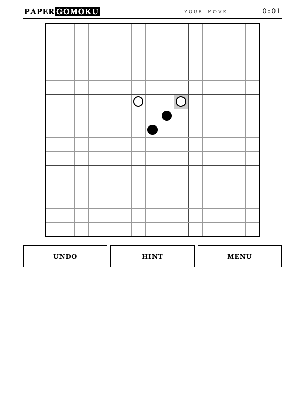

# PaperGomoku

Offline five-in-a-row vs bot, designed for Kindle e-ink browsers.

<p align="center">
  
</p>

## What it is

A self-contained gomoku (five in a row) game with its own rules engine and
bot. One page, one screen, no scrolling, no network calls — everything runs
locally in the browser.

## Kindle-first design

- **ES5, zero dependencies** — runs on old WebKit
- **Two screens** — dedicated setup and zero-scroll play screens
- **Partial repaints** — only changed cells redraw after each move
- **Big targets** — whole intersection is the tap area, 44px+ buttons
- **Auto-fit** — board sizes to the viewport on load and resize
- **Autosave** — game state and stats use guarded localStorage for Kindle
  firmware compatibility

## Play

### 1 vs 1

- Tap any intersection to place your stone; the bot replies
- First to line up five (or more) wins — the line is highlighted
- Choose BLACK (you move first) or WHITE (bot moves first)
- UNDO takes back your move and the bot's reply
- HINT asks a stronger engine (level 3) for a suggestion (1 vs bot only)

### 2 players (hotseat)

- Two humans share one device — BLACK and WHITE alternate turns, no bot
- Turn banner shows whose move: `● BLACK MOVE` / `○ WHITE MOVE`
- UNDO takes back one move (the previous player's); no HINT button
- Winner banner names the color: `● BLACK WINS` / `○ WHITE WINS`
- Setup screen keeps a running tally: `● 3–1 ○` (RESET SCORE clears it)

Both modes: lazy clock, no per-second repaints — e-ink friendly.

## Bot levels

| Level | Name   | Style |
|-------|--------|-------|
| 1     | Casual | loose play, some random moves |
| 2     | Club   | takes wins, blocks threats |
| 3     | Master | attack + defense pattern scoring |

## Architecture

- [`index.html`](index.html) — application entry point
- [`js/engine.js`](js/engine.js) — rules, win detection, bot (color-based;
    2-player mode is purely app-layer flow)
- [`js/app.js`](js/app.js) — interface, mode/seat model, game flow
    (turn derived from move log: seat = moves % seats)
- [`css/papergomoku.css`](css/papergomoku.css) — Kindle-first presentation
- [`tests/`](tests/) — node scripts: win detection, blocking, full games,
    DOM-stubbed app smoke test

```bash
node tests/engine.js    # engine correctness
node tests/app-smoke.js # app flow with stubbed DOM
./serve.sh              # LAN serve for Kindle
```

## Contributing

Issues and pull requests are welcome. Keep changes dependency-free, compatible
with ES5-era WebKit, and usable on slow grayscale e-ink displays.

## License

PaperGomoku is available under the [MIT License](LICENSE).

---

Made by [8ugust.dev](https://8ugust.dev)
